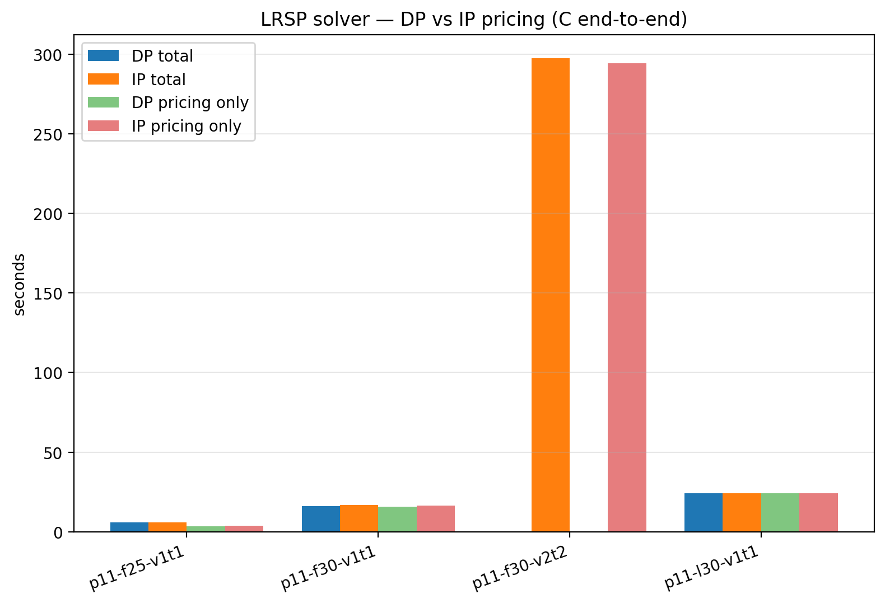

# LRSP DP vs IP — both engines in C

Both pricing engines run inside the same C LRSP solver (`lrsp_native/run_lrsp.exe`). The full Akca formulation is enabled (coverage `==1`, capacity `≤`, linking `Σ_{p covers i, uses j} λ_p − y_j ≤ 0`, min-open `Σ y_j ≥ K`). The master is HiGHS-backed; pricing is the vendored `mespprc_native` library, with Phase 2 doing route-network DP (`Phase2DPSolver`) or set-partitioning IP via HiGHS (`Phase2IPSolver`) depending on the engine. Phase 1 (ESPPRC labelling) is identical for both engines. Phase 2 only fires when `vehicle_time_limit` is set AND a facility produced ≥ 2 negative-reduced-cost Phase 1 routes — for harder instances this drives the DP vs IP gap.

## Per-instance results

| Instance | C | F | reach | DP iters | IP iters | DP cols | IP cols | DP total | IP total | DP master | IP master | DP pricing | IP pricing | DP root LP | IP root LP | DP integer | IP integer |
|---|---|---|---|---|---|---|---|---|---|---|---|---|---|---|---|---|---|
| p11-f25-v1t1 | 25 | 5 | yes | 10 | 10 | 601 | 601 | 5.73 s | 5.92 s | 20.0 ms | 24.4 ms | 3.26 s | 3.60 s | 8462.0832 | 8462.0832 | 8579.9155 | 8579.9155 |
| p11-f30-v1t1 | 30 | 5 | yes | 12 | 12 | 699 | 699 | 15.94 s | 16.62 s | 33.2 ms | 35.9 ms | 15.84 s | 16.51 s | 8757.6345 | 8757.6345 | 8780.4794 | 8780.4794 |
| p11-f30-v2t2 | 30 | 5 | no | — | 13 | — | 786 | — | 297.55 s | — | 45.1 ms | — | 294.27 s | — | 8037.2433 | — | 8421.8794 |
| p11-l30-v1t1 | 30 | 5 | yes | 12 | 12 | 741 | 741 | 24.19 s | 24.19 s | 30.6 ms | 31.2 ms | 24.07 s | 24.07 s | 11283.5856 | 11283.5856 | 11314.5739 | 11314.5739 |

## Aggregate

- Instances run: 4
- Both engines completed: 3
- DP mean total runtime: 15.28 s ± 7.55 s
- IP mean total runtime: 86.07 s ± 122.27 s
- DP mean pricing runtime: 14.39 s ± 8.56 s
- IP mean pricing runtime: 84.61 s ± 121.27 s
- DP/IP total-runtime ratio: mean 0.98x, min 0.96x, max 1.00x
- DP/IP pricing-runtime ratio: mean 0.95x, min 0.90x, max 1.00x



## Conclusions

- **IP completed instances DP could not.** On p11-f30-v2t2 the DP engine hit the per-instance time budget while IP finished. This is the single most important result here: at the harder Akca settings (e.g. larger vehicle capacity and time limit, which let Phase 1 explore deeper trees), DP is no longer competitive.
- **Among instances both engines completed** (3 of 4): DP wins total runtime on 3, IP wins on 0. Mean DP/IP total-runtime ratio is 0.98× — i.e. on these easier instances the two engines are within a few percent of each other.
- **Pricing-only runtime** (the only piece that actually differs between the engines; master, Phase 1, and warmstart are shared code): DP wins on 3, IP wins on 0 of the 3 both-completed pairs.
- **Root-LP objectives match**: 3/3 agree to 1e-4. They should always match — both engines see the same Phase 1 routes and the same master, so any difference would be a bug.
- **Why DP and IP look so close on easy instances**: Phase 2 fires only when a facility's Phase 1 returns ≥ 2 negative-RC routes. For most CG iterations on `v1t1`/`l30` settings only Phase 1 singletons are needed, so DP and IP do essentially the same work per pricing call. The gap opens once Phase 2 starts carrying real load — exactly what happens on `v2t2` (vehicle_cap=200, time_limit=260), where DP fails to finish.
- **Connection to the standalone MESPPRC benchmark.** The standalone Phase 2 DP-vs-IP study (`mespprc_native/scripts/paper_phase2_dp_vs_ip.py`) found a crossover at n≈6 customers: DP wins below, IP wins from there. In the LRSP setting a single pricing call sees only one facility's customers (≤ n_customers in the instance), so the MESPPRC crossover translates into 'DP is fine on small / loose instances, IP is needed on harder / looser ones.' The Akca v2t2 result is the LRSP-level analogue of the MESPPRC crossover.

## Reproducing

```bash
python lrsp_native/scripts/paper_lrsp_dp_vs_ip.py
```
