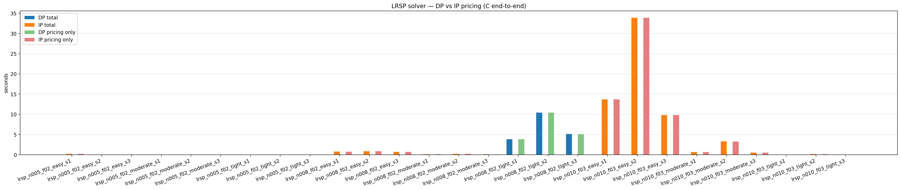

# LRSP DP vs IP — both engines in C

Both pricing engines run inside the same C LRSP solver (`lrsp_native/run_lrsp.exe`). The full Akca formulation is enabled (coverage `==1`, capacity `≤`, linking `Σ_{p covers i, uses j} λ_p − y_j ≤ 0`, min-open `Σ y_j ≥ K`). The master is HiGHS-backed; pricing is the vendored `mespprc_native` library, with Phase 2 doing route-network DP (`Phase2DPSolver`) or set-partitioning IP via HiGHS (`Phase2IPSolver`) depending on the engine. Phase 1 (ESPPRC labelling) is identical for both engines. Phase 2 only fires when `vehicle_time_limit` is set AND a facility produced ≥ 2 negative-reduced-cost Phase 1 routes — for harder instances this drives the DP vs IP gap.

## Per-instance results

| Instance | C | F | reach | DP iters | IP iters | DP cols | IP cols | DP total | IP total | DP master | IP master | DP pricing | IP pricing | DP root LP | IP root LP | DP integer | IP integer |
|---|---|---|---|---|---|---|---|---|---|---|---|---|---|---|---|---|---|
| lrsp_n005_f02_easy_s1 | 5 | 2 | yes | 5 | 5 | 99 | 99 | 20.1 ms | 203.7 ms | 2.4 ms | 2.4 ms | 15.7 ms | 199.4 ms | 815.3832 | 815.3832 | 815.3832 | 815.3832 |
| lrsp_n005_f02_easy_s2 | 5 | 2 | yes | 5 | 5 | 87 | 87 | 19.9 ms | 19.7 ms | 2.5 ms | 2.6 ms | 15.5 ms | 15.3 ms | 764.9014 | 764.9014 | 764.9014 | 764.9014 |
| lrsp_n005_f02_easy_s3 | 5 | 2 | yes | 5 | 5 | 69 | 69 | 18.4 ms | 18.7 ms | 2.4 ms | 2.4 ms | 14.2 ms | 14.6 ms | 555.0204 | 555.0204 | 555.0204 | 555.0204 |
| lrsp_n005_f02_moderate_s1 | 5 | 2 | yes | 4 | 4 | 69 | 69 | 15.1 ms | 22.8 ms | 2.6 ms | 2.7 ms | 8.4 ms | 16.2 ms | 939.8380 | 939.8380 | 962.5521 | 962.5521 |
| lrsp_n005_f02_moderate_s2 | 5 | 2 | yes | 4 | 4 | 73 | 73 | 14.5 ms | 17.4 ms | 2.4 ms | 2.5 ms | 8.9 ms | 11.5 ms | 830.5612 | 830.5612 | 839.6913 | 839.6913 |
| lrsp_n005_f02_moderate_s3 | 5 | 2 | yes | 4 | 4 | 69 | 69 | 9.8 ms | 12.2 ms | 2.4 ms | 2.5 ms | 5.7 ms | 8.0 ms | 601.2305 | 601.2305 | 601.2305 | 601.2305 |
| lrsp_n005_f02_tight_s1 | 5 | 2 | yes | 3 | 3 | 48 | 48 | 5.2 ms | 10.8 ms | 2.2 ms | 2.5 ms | 1.2 ms | 6.1 ms | 1595.7415 | 1595.7415 | 1597.9464 | 1597.9464 |
| lrsp_n005_f02_tight_s2 | 5 | 2 | yes | 4 | 4 | 58 | 58 | 9.0 ms | 18.5 ms | 2.5 ms | 2.6 ms | 3.8 ms | 13.3 ms | 1362.7454 | 1362.7454 | 1383.5810 | 1383.5810 |
| lrsp_n005_f02_tight_s3 | 5 | 2 | yes | 3 | 3 | 29 | 29 | 4.4 ms | 7.6 ms | 2.3 ms | 2.2 ms | 0.9 ms | 4.2 ms | 888.1701 | 888.1701 | 888.1701 | 888.1701 |
| lrsp_n008_f02_easy_s1 | 8 | 2 | no | — | 8 | — | 133 | — | 765.3 ms | — | 3.5 ms | — | 756.7 ms | — | 903.4579 | — | 943.2976 |
| lrsp_n008_f02_easy_s2 | 8 | 2 | no | — | 6 | — | 157 | — | 882.6 ms | — | 3.2 ms | — | 873.9 ms | — | 754.9996 | — | 778.9435 |
| lrsp_n008_f02_easy_s3 | 8 | 2 | no | — | 8 | — | 173 | — | 678.1 ms | — | 3.6 ms | — | 670.7 ms | — | 807.9547 | — | 807.9547 |
| lrsp_n008_f02_moderate_s1 | 8 | 2 | no | — | 8 | — | 146 | — | 109.5 ms | — | 3.3 ms | — | 103.8 ms | — | 1047.1093 | — | 1047.1093 |
| lrsp_n008_f02_moderate_s2 | 8 | 2 | no | — | 7 | — | 145 | — | 220.6 ms | — | 3.7 ms | — | 213.7 ms | — | 832.0413 | — | 832.0413 |
| lrsp_n008_f02_moderate_s3 | 8 | 2 | no | — | 6 | — | 140 | — | 107.6 ms | — | 3.2 ms | — | 99.2 ms | — | 914.0007 | — | 955.7036 |
| lrsp_n008_f02_tight_s1 | 8 | 2 | yes | 6 | 6 | 88 | 88 | 3.85 s | 19.5 ms | 2.9 ms | 2.7 ms | 3.84 s | 14.7 ms | 1649.5156 | 1649.5156 | 1650.5415 | 1650.5415 |
| lrsp_n008_f02_tight_s2 | 8 | 2 | yes | 5 | 5 | 97 | 97 | 10.42 s | 19.9 ms | 3.1 ms | 2.6 ms | 10.41 s | 15.2 ms | 1274.6846 | 1274.6846 | 1274.6846 | 1274.6846 |
| lrsp_n008_f02_tight_s3 | 8 | 2 | yes | 5 | 5 | 76 | 76 | 5.12 s | 15.4 ms | 2.7 ms | 2.5 ms | 5.11 s | 10.0 ms | 1422.8242 | 1422.8242 | 1446.4942 | 1446.4942 |
| lrsp_n010_f03_easy_s1 | 10 | 3 | no | — | 11 | — | 365 | — | 13.70 s | — | 5.9 ms | — | 13.68 s | — | 719.1996 | — | 719.1996 |
| lrsp_n010_f03_easy_s2 | 10 | 3 | no | — | 12 | — | 418 | — | 33.89 s | — | 8.5 ms | — | 33.87 s | — | 852.6133 | — | 899.5122 |
| lrsp_n010_f03_easy_s3 | 10 | 3 | no | — | 10 | — | 302 | — | 9.82 s | — | 5.2 ms | — | 9.80 s | — | 815.1214 | — | 815.1214 |
| lrsp_n010_f03_moderate_s1 | 10 | 3 | no | — | 8 | — | 254 | — | 649.0 ms | — | 3.8 ms | — | 640.2 ms | — | 1140.0110 | — | 1149.8253 |
| lrsp_n010_f03_moderate_s2 | 10 | 3 | no | — | 8 | — | 289 | — | 3.33 s | — | 5.6 ms | — | 3.28 s | — | 1397.6026 | — | 1442.8618 |
| lrsp_n010_f03_moderate_s3 | 10 | 3 | no | — | 7 | — | 215 | — | 515.0 ms | — | 3.6 ms | — | 502.2 ms | — | 1285.3306 | — | 1322.9175 |
| lrsp_n010_f03_tight_s1 | 10 | 3 | no | — | 6 | — | 148 | — | 50.5 ms | — | 2.8 ms | — | 41.8 ms | — | 1647.7597 | — | 1670.2671 |
| lrsp_n010_f03_tight_s2 | 10 | 3 | no | — | 8 | — | 221 | — | 150.1 ms | — | 3.6 ms | — | 141.9 ms | — | 1971.4340 | — | 1973.6670 |
| lrsp_n010_f03_tight_s3 | 10 | 3 | no | — | 5 | — | 151 | — | 32.7 ms | — | 2.7 ms | — | 26.8 ms | — | 1801.2050 | — | 1804.8823 |

## Aggregate

- Instances run: 27
- Both engines completed: 12
- DP mean total runtime: 1.63 s ± 3.13 s
- IP mean total runtime: 2.42 s ± 6.91 s
- DP mean pricing runtime: 1.62 s ± 3.13 s
- IP mean pricing runtime: 2.41 s ± 6.90 s
- DP/IP total-runtime ratio: mean 88.27x, min 0.10x, max 523.51x
- DP/IP pricing-runtime ratio: mean 121.89x, min 0.08x, max 685.00x



## Conclusions

- **IP completed 15 instance(s) where DP timed out**: lrsp_n008_f02_easy_s1, lrsp_n008_f02_easy_s2, lrsp_n008_f02_easy_s3, lrsp_n008_f02_moderate_s1, lrsp_n008_f02_moderate_s2 + 10 more. Past a certain instance complexity (driven by `vehicle_capacity_factor` and `vehicle_time_factor` — both controlling how many customers a single Phase 1 trip can carry), the route-network DP's label space explodes and the engine cannot finish. IP, leaning on HiGHS branch-and-bound over a tight set-partitioning LP, scales gracefully.
- **Among instances both engines completed** (12 of 27): DP wins total runtime on 8, IP wins on 4. Median DP/IP total-runtime ratio is 0.82×; worst-case (max) is 523.51× — meaning on the harder of the both-completed instances DP is hundreds of times slower than IP.
- **Pricing-only runtime** (the only piece that actually differs between the engines; master, Phase 1, and warmstart are shared code): DP wins on 8, IP wins on 4 of the 12 both-completed pairs.
- **Root-LP objectives match**: 12/12 agree to 1e-4. They should always match — both engines see the same Phase 1 routes and the same master, so any difference would be a bug.
- **Headline.** This corpus stresses Phase 2 hard enough that the route-network DP becomes the dominant bottleneck. IP-based pricing is the practical default for any non-trivial LRSP instance; DP is competitive only for very small N where Phase 2's label space stays compact.
- **Connection to the standalone MESPPRC benchmark.** The standalone Phase 2 DP-vs-IP study (`mespprc_native/scripts/paper_phase2_dp_vs_ip.py`) found a crossover at n≈6 customers: DP wins below, IP wins from there. In LRSP a single pricing call works on at most N customers per facility; whenever the pricing graph admits long enough trips for Phase 2 to fire, DP's label-DP exponential blow-up reproduces here at the LRSP level.

## Reproducing

```bash
python lrsp_native/scripts/paper_lrsp_dp_vs_ip.py
```
