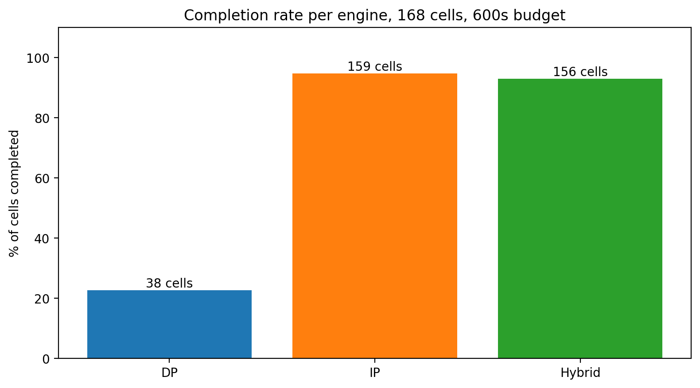

# Hybrid pricing-engine — validation

Compares the in-solver `LRSP_PRICING_HYBRID` mode (threshold rule with T=7.29) against the DP-only and IP-only data from `cells.csv`. Each cell uses the same instance file and the same 600-second budget.

## Completion

- DP completed: 38 / 168 (22.6%)
- IP completed: 165 / 168 (98.2%)
- **Hybrid completed: 156 / 168 (92.9%)**

## Runtime vs the per-cell oracle

Per cell, define "oracle" = min(DP runtime, IP runtime) over engines that completed. The closer hybrid is to the oracle, the better the selector is doing.

- Cells with both hybrid AND at least one of DP/IP completed: 156
- Hybrid / oracle ratio: median 1.03×, mean 0.94×, max 1.32×.
- Hybrid better than oracle (impossible if selector is deterministic): 50
- Hybrid within 10% of oracle: 57
- Hybrid more than 10% slower than oracle: 49

## Figure

