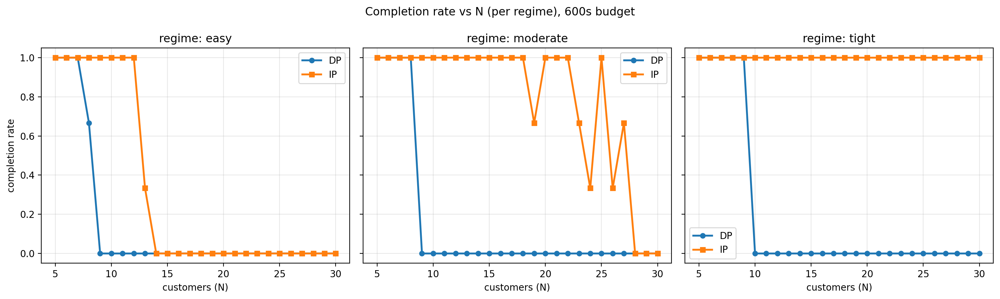
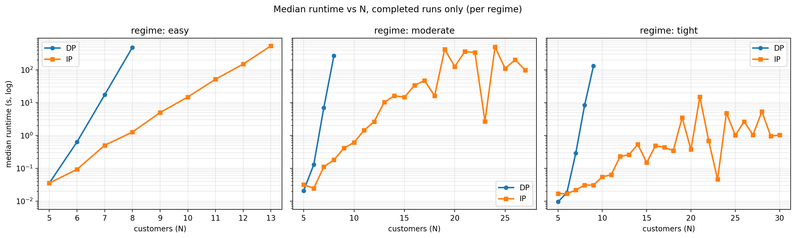
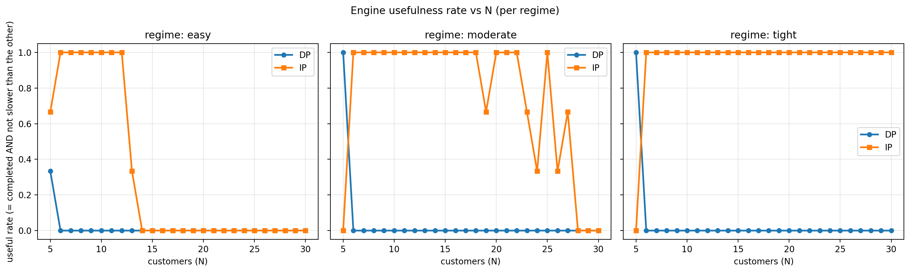
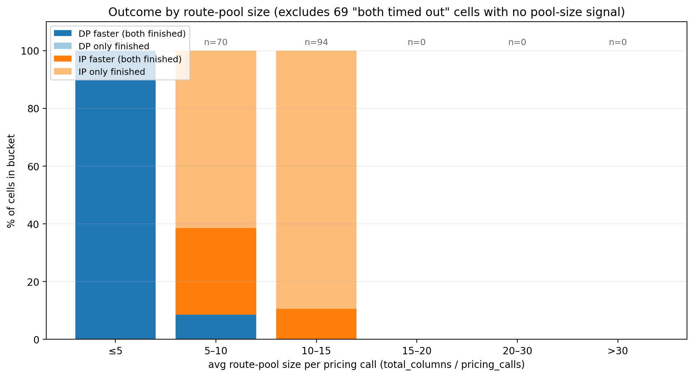
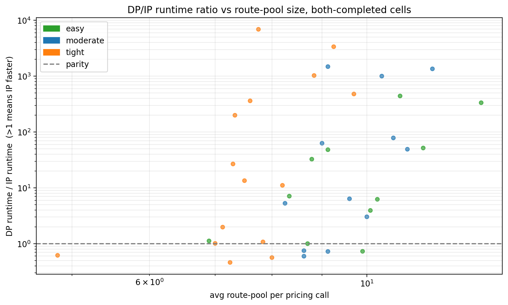

# LRSP DP vs IP — dense sweep (model-training data set)

This sweep is the data set the future hybrid pricing-engine selector will train on. It samples N continuously from 5 to 30 with a deterministic facility count F = max(2, N // 3) — no F-confound. Three regimes (easy, moderate, tight) and three seeds per regime.

## Sweep parameters

- N (customers): 5..30 (every integer, 26 values)
- F (facilities): deterministic, F(N) = max(2, N // 3)
- Regimes: ['easy', 'moderate', 'tight'] (β_v / β_f / γ_t per the table below)
- Seeds: [1, 2, 3]
- Total cells: 26 × 3 × 3 = 234
- Both engines per cell, time budget 600 s each.

Regime knobs (numerical, captured per-cell as features):

| Regime   | β_v | β_f | γ_t |
|----------|-----|-----|-----|
| easy | 4.0 | 3.0 | 4.0 |
| moderate | 2.5 | 2.0 | 2.5 |
| tight | 1.7 | 1.4 | 1.7 |

## Top-line numbers

- 234 cells attempted. DP completed 38 (16.2%); IP completed 165 (70.5%). Both completed: 38 cells; both timed out: 69 cells.

| Regime | total | DP useful | IP useful | both timed out |
|--------|------:|----------:|----------:|---------------:|
| easy | 78 | 1 (1%) | 24 (31%) | 53 (68%) |
| moderate | 78 | 3 (4%) | 59 (76%) | 16 (21%) |
| tight | 78 | 3 (4%) | 75 (96%) | 0 (0%) |
| **all** | 234 | **7 (3%)** | **158 (68%)** | 69 (29%) |

*"useful" = engine completed within budget AND was no slower than the other engine that also completed (or was the only one to complete). Same definition used in the v1 sparse sweep so the two are directly comparable.*

## DP completion cliff (per regime)

Smallest N where DP completion rate falls below 50%:

- **easy**: DP collapses at N = 9.
- **moderate**: DP collapses at N = 9.
- **tight**: DP collapses at N = 10.

## Figures

### Completion Dense



**Completion rate vs N**, faceted by regime. Each point is the fraction of (F, seed) replicates the engine finished within the time budget. The DP curves show the regime-dependent collapse the v1 sweep only hinted at.

### Runtime Dense



**Median runtime vs N**, faceted by regime, log-Y. Only includes completed runs. Where DP is absent it timed out.

### Useful Rate



**Engine usefulness rate vs N**, faceted by regime. "Useful" = completed AND not slower than the other engine. This is the right metric for picking a default engine.

### Winner By Pool Size Dense



**Outcome by route-pool size**. Per-cell pool size is total_columns / pricing_calls. Both-timed-out cells are excluded since they have no pool-size signal.

### Speedup Vs Pool



**DP/IP runtime ratio vs route-pool size**, both-completed cells only. Y > 1 means IP wins. Color-coded by regime.

## Hybrid pricing-engine selector — data set spec

The companion file `cells.csv` is the model-training table. One row per attempted (n, F, regime, seed) cell; columns split into **features** (input to the selector) and **outcomes** (training labels).

### Features (known before pricing call)

Static instance features:

- `n`, `f` — customer / facility counts.
- `bv_factor`, `bf_factor`, `gt_factor` — regime knobs as continuous numbers; captures vehicle-capacity, facility-capacity, and time-limit slack.
- `total_demand`, `mean_demand`, `max_demand`, `std_demand` — demand distribution.
- `vehicle_capacity`, `vehicle_time_limit`, `vehicle_fixed_cost` — vehicle parameters.
- `mean_cust_nearest_fac_dist`, `max_cust_nearest_fac_dist`, `mean_cust_cust_dist` — geometric structure.
- `demand_to_capacity_ratio` = total_demand / Σ facility_capacity. How tightly we're packing facilities.
- `max_singleton_round_trip`, `avg_singleton_round_trip` — shortest one-customer trips, in cost units.
- `gt_slack` = vehicle_time_limit / max_singleton_round_trip. Effective per-vehicle time slack — a strong predictor.
- `bv_slack` = vehicle_capacity / max_demand. Effective vehicle-capacity slack — also a strong predictor.

Phase 1 / pricing-state features (observable per call):

- `*_pricing_calls`, `*_total_columns`, `*_phase1_route_columns`, `*_phase2_pairing_columns` — engine-specific aggregates over the whole CG run.
- `*_avg_pool_per_call` = total_columns / pricing_calls. The single best one-shot predictor for which engine is faster (see `fig_winner_by_pool_size_dense.png`).
- `avg_pool_per_call` (without engine prefix) — the same proxy computed from whichever engine finished, intended as the deployed selector's runtime feature.

### Outcomes (training labels)

- `winner` ∈ {`dp`, `ip`, `tie`, `dp_only`, `ip_only`, `both_to`} — categorical label.
- `dp_useful`, `ip_useful` — binary labels per engine. **The primary classification target** for a "is this engine useful here?" model.
- `speedup_ip_over_dp` = dp_total_seconds / ip_total_seconds when both finished (>1 → IP wins, <1 → DP wins). **The regression target** for a "how much faster is one over the other?" model.
- `log_speedup` = log10 of the above. Convenient when fitting linear models.

### Suggested approach for the future selector

Based on `fig_winner_by_pool_size_dense.png` and the dominance of `avg_pool_per_call` as a single feature, a useful baseline is the threshold rule:

```
if avg_pool_per_call <= POOL_THRESHOLD:
    use_dp = True       # tiny pool — DP overhead < HiGHS overhead
else:
    use_dp = False      # large pool — DP exponential dominates
```

Tune `POOL_THRESHOLD` on this data; the v1 result suggests ~5-8. For a learned model, fit a logistic regression / gradient-boosted tree on the features above with `dp_useful` as the target. Use `gt_slack`, `bv_slack`, `bv_factor`, `bf_factor`, and an estimate of `avg_pool_per_call` (which can be predicted from instance features alone after a few CG iterations) as inputs. Cross-validate by leaving out one regime at a time.

## Reproducing

```bash
python lrsp_native/scripts/paper_lrsp_dp_vs_ip_dense.py --time-limit-seconds 600
```

Add `--reanalyze` to rebuild this report and the figures from the existing `cells.csv` / `raw_results.csv` without re-running the C solver.