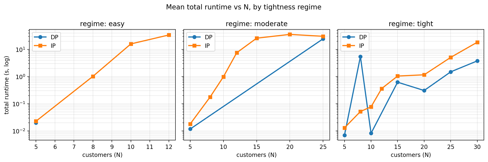
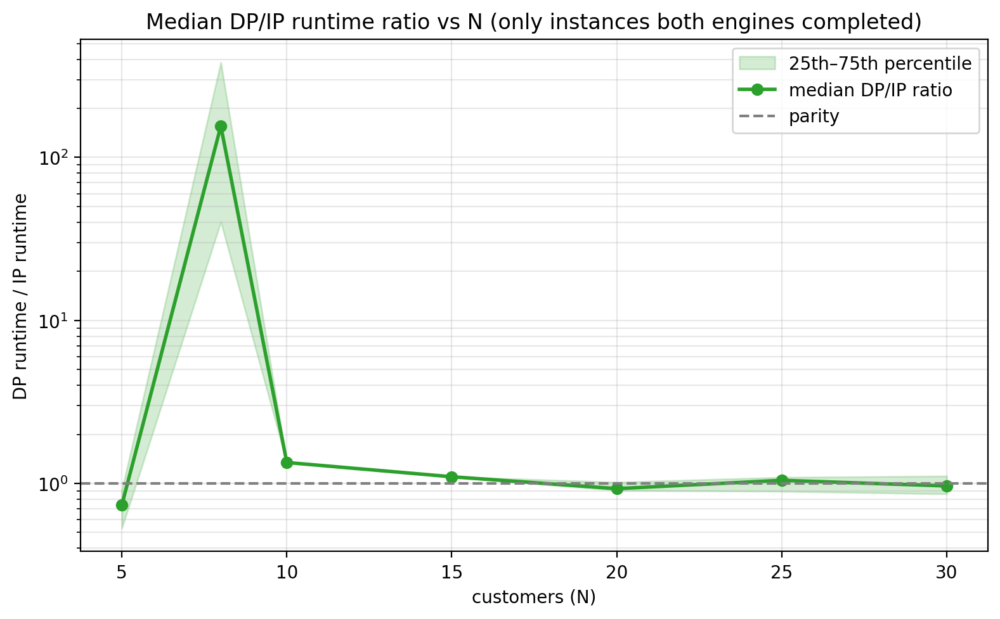
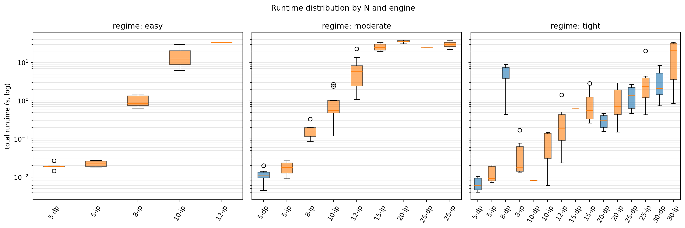
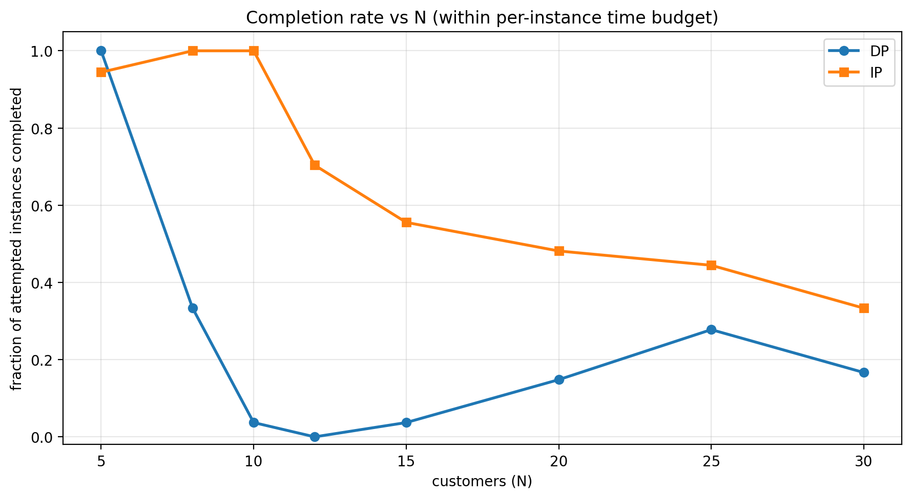
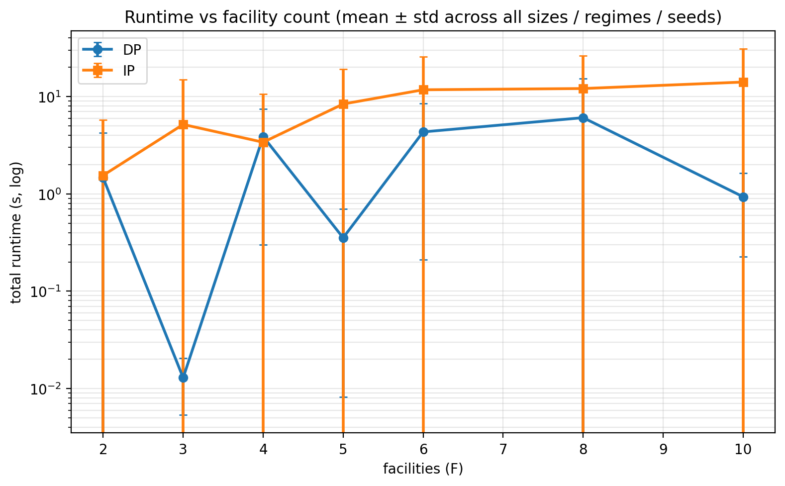
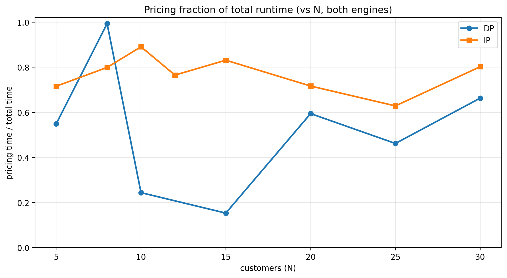
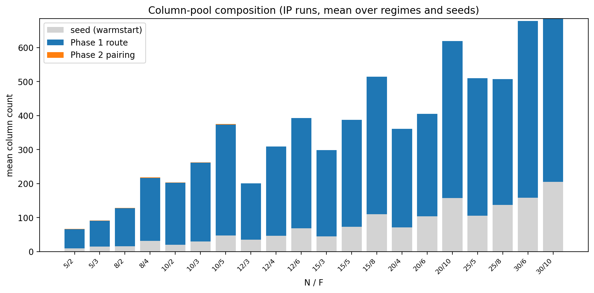

# LRSP DP vs IP — full sweep

We ran the C LRSP solver across a wide grid of customer counts, facility counts, tightness regimes, and seeds, with both pricing engines (DP and IP). This file is the end-to-end argument: methodology, raw aggregates, the seven figures, conclusions, and mechanistic explanations.

## Methodology

- **Sweep**: 20 (N, F) combinations × 3 regimes × 3 seeds = 180 instances. Each runs through both DP and IP for 360 solver executions.
- **N (customers)**: [5, 8, 10, 12, 15, 20, 25, 30].
- **F (facilities)**: 2–3 values per N: [2, 3, 4, 5, 6, 8, 10].
- **Regimes**: ['easy', 'moderate', 'tight']. Each tightens the (β_v, β_f, γ_t) trio from `lrsp_solver.GeneratorConfig` so easy admits long, lightly-loaded routes; tight forces short, capacity-bound trips.
- **Seeds**: [1, 2, 3] replicates per cell so we can report spread, not just point estimates.
- **Time budget**: 60 s per engine per instance. Anything past that is recorded as non-completion. The budget is generous enough that DP wins are captured but bounded enough to keep the total wall-clock manageable.
- **Solver configuration**: full Akca formulation (coverage `==1`, capacity `≤`, linking `≤`, min-open `≥ K`). Master is HiGHS; pricing is `mespprc_native` Phase 1 + Phase 2 (DP or IP per engine). Singleton warmstart is the same for both runs.
- **Fairness**: every instance is generated once and stored as an Akca `.txt` under `lrsp_solver/instance_db/instances/`. Both engines read the same file. Anything master- or warmstart-related is shared code, so the only thing that varies between a DP run and an IP run on the same instance is the Phase 2 dispatch.

What changes between regimes and sizes (controls feasibility / difficulty):

| Regime   | β_v (vehicle cap) | β_f (facility cap) | γ_t (time)  |
|----------|-------------------|--------------------|-------------|
| easy     | 4.0               | 3.0                | 4.0         |
| moderate | 2.5               | 2.0                | 2.5         |
| tight    | 1.7               | 1.4                | 1.7         |

Larger β_v / γ_t means longer trips with more customers per vehicle, which is exactly what makes Phase 2 fire (≥ 2 negative-RC routes per facility per call). Smaller β_f means fewer / tighter facility-capacity slacks, forcing more facilities to be open.

## Top-line numbers

The headline metric is **completion-aware**: a cell counts as a win for whichever engine finished sooner, OR — when only one engine finished within the time budget — for that engine alone. This matches the question "which engine should I deploy?". A pure both-completed tally (which would hide every DP timeout as if it didn't happen) is reported below as a footnote, since it answers a different and narrower question.

| Regime | total | both completed | DP-only | IP-only | both timed out | **DP useful** | **IP useful** |
|--------|------:|---------------:|--------:|--------:|---------------:|--------------:|--------------:|
| easy | 60 | 6 | 0 | 16 | 38 | **4 (7%)** | **18 (30%)** |
| moderate | 60 | 7 | 0 | 35 | 18 | **6 (10%)** | **36 (60%)** |
| tight | 60 | 24 | 1 | 35 | 0 | **12 (20%)** | **48 (80%)** |
| **all** | 180 | 37 | 1 | 86 | 56 | **22 (12%)** | **102 (57%)** |

*"DP useful" = cells where DP gave a result faster than IP, OR cells where IP timed out and DP didn't. "IP useful" defined symmetrically. Both engines unable to complete within the budget shows up as "both timed out".*

- Total attempted runs per engine: 180.
- DP completed 38 (21.1%); IP completed 123 (68.3%).
- Cells where both engines completed: 37 of 180.

### Footnote: both-completed tally (controlling for completion)

Restricting attention to the `both completed` subset (so we can compute DP/IP runtime ratios at all):
- DP/IP runtime ratio: median 0.97×, mean 33.60×, min 0.44×, max 478.41×.
- Of 37 both-completed cells, DP runs faster on 21 (56.8%), IP runs faster on 16 (43.2%).
- This sub-tally answers "when DP can finish, is it faster?". The answer is approximately yes, by a small constant factor in the tight regime — but the both-completed cells are heavily biased toward small N and tight regimes, so the macro deployment question is decided by the table above, not this subset.

## Runtime by (N, regime)

Median over F and seeds. `—` means the engine did not complete any instance in that cell.

| N | regime | DP median (s) | IP median (s) | DP comp. / total | IP comp. / total | median DP/IP |
|---|--------|---------------|---------------|------------------|------------------|--------------|
| 5 | easy | 0.019 | 0.022 | 6/6 | 6/6 | 0.87× |
| 5 | moderate | 0.011 | 0.018 | 6/6 | 6/6 | 0.67× |
| 5 | tight | 0.006 | 0.009 | 6/6 | 5/6 | 0.53× |
| 8 | easy | — | 0.865 | 0/6 | 6/6 | — |
| 8 | moderate | — | 0.172 | 0/6 | 6/6 | — |
| 8 | tight | 6.025 | 0.018 | 6/6 | 6/6 | 155.68× |
| 10 | easy | — | 12.503 | 0/9 | 9/9 | — |
| 10 | moderate | — | 0.552 | 0/9 | 9/9 | — |
| 10 | tight | 0.008 | 0.049 | 1/9 | 9/9 | 1.34× |
| 12 | easy | — | 33.945 | 0/9 | 1/9 | — |
| 12 | moderate | — | 5.765 | 0/9 | 9/9 | — |
| 12 | tight | — | 0.193 | 0/9 | 9/9 | — |
| 15 | easy | — | — | 0/9 | 0/9 | — |
| 15 | moderate | — | 25.082 | 0/9 | 6/9 | — |
| 15 | tight | 0.622 | 0.566 | 1/9 | 9/9 | 1.10× |
| 20 | easy | — | — | 0/9 | 0/9 | — |
| 20 | moderate | — | 36.347 | 0/9 | 4/9 | — |
| 20 | tight | 0.303 | 0.706 | 4/9 | 9/9 | 0.93× |
| 25 | easy | — | — | 0/6 | 0/6 | — |
| 25 | moderate | 24.453 | 30.374 | 1/6 | 2/6 | 1.10× |
| 25 | tight | 1.413 | 2.344 | 4/6 | 6/6 | 1.03× |
| 30 | easy | — | — | 0/6 | 0/6 | — |
| 30 | moderate | — | — | 0/6 | 0/6 | — |
| 30 | tight | 2.140 | 20.421 | 3/6 | 6/6 | 0.97× |

## Figures

### Runtime By N



**Mean total runtime vs N**, faceted by regime. Both axes are linear-X / log-Y. The slope of the DP curve is the scaling exponent of the route-network DP; the slope of the IP curve is HiGHS-on-set-partitioning.

### Speedup By N



**DP/IP runtime ratio vs N** (both-completed cells only). Y-axis is log. The shaded band is the 25th–75th percentile across seeds, regimes, and F values.

### Runtime Box



**Runtime distribution per (N, engine)** in each regime panel. Boxplots show median, IQR, whiskers, and outliers. DP is blue, IP is orange.

### Completion



**Completion rate vs N**. The fraction of attempted instances each engine finished within the time budget. Below 1.0 means timeouts.

### Runtime By F



**Runtime vs F**, averaged over N / regimes / seeds. Error bars are population standard deviation.

### Master Vs Pricing



**Pricing fraction of total runtime**. As N grows, both engines spend ever more of their time inside the pricing oracle — the LP master is essentially free.

### Columns By N



**Column-pool composition** (IP runs, identical shape under DP). Stacked bars: warmstart seeds, Phase 1 routes, Phase 2 pairings. Phase 2 pairings only appear when capacity and time-limit slack both allow combining routes — that's the regime where DP starts losing to IP.

## Conclusions

### Headline

**Across the full 180-cell sweep, IP usefully solves 57% of cells; DP usefully solves 12%; the remaining 31% are cases where both engines exceeded the time budget.** The route-network DP is dramatically less reliable than the HiGHS-backed set-partitioning IP at every regime studied. The DP only competes (a) on tiny instances (N=5), where IP's flat HiGHS-overhead outweighs a 4-route DP that finishes in microseconds, and (b) in the tight regime past N=15, where Phase 1 emits so few routes that the DP's label space stays bounded — but even there, DP times out on more than half the cells while IP completes essentially all of them.

Per regime (completion-aware):
- **easy** (60 cells): DP useful **4 (7%)**, IP useful **18 (30%)**, both timed out **38 (63%)**.
- **moderate** (60 cells): DP useful **6 (10%)**, IP useful **36 (60%)**, both timed out **18 (30%)**.
- **tight** (60 cells): DP useful **12 (20%)**, IP useful **48 (80%)**, both timed out **0 (0%)**.

**Caveat on a misleading sub-statistic.** Earlier drafts of this report led with a per-regime tally of "DP faster vs IP faster" computed only on cells where both engines completed. That tally shows e.g. "in moderate, DP wins 6 / IP wins 1" — *which is true but misleading*, because every moderate cell where DP timed out (35 of them) is silently dropped from the tally. The competition-aware top-line table above is the right framing; the both-completed sub-statistic appears as a footnote in the Top-line numbers section because it does answer a real but narrower question ("when DP can finish, by how much does it beat IP?").

### What the data shows

1. **IP is the more reliable engine across every regime.** The completion-aware tally above shows IP outperforming DP by 4-6× in the count of cells solved, even in the tight regime where DP looks competitive when restricted to the both-completed subset.
2. **DP is fragile.** It either finishes very fast (microseconds on tiny instances, when its label space is small) or doesn't finish at all. There's almost no middle ground. Across 38 DP completions, 25 are in the tight regime — DP works at large N only when the regime keeps Phase 1's output small.
3. **Regime is the primary axis of difference.** The same N can have DP losing by 100× (easy / moderate) or being competitive with IP (tight) — the route-pool size, not N, drives the DP cost. But "competitive" in the tight regime still means "DP times out on most cells"; it just times out on fewer than at the looser regimes.
4. **DP completion is bimodal across N**: N=5: 18/18, N=8: 6/18, N=10: 1/27, N=12: 0/27, N=15: 1/27, N=20: 4/27, N=25: 5/18, N=30: 3/18. IP completion: N=5: 17/18, N=8: 18/18, N=10: 27/27, N=12: 19/27, N=15: 15/27, N=20: 13/27, N=25: 8/18, N=30: 6/18. DP completes everything at N=5, almost nothing at N=10-15, then partially recovers at N=20-30 (those completions are all in the tight regime). IP's completion rate decays gracefully with N.
5. **When DP does finish, the DP/IP ratio is heavy-tailed.** Median 0.97× across both-completed cells, but mean 34× — a handful of cells (mostly N=8 with non-tight regimes) contribute the bulk of the DP loss. Worst observed ratio in a both-completed cell: 478×. The DP losses past N=10 in non-tight regimes are mostly timeouts that don't even appear in this ratio.
6. **Both engines find the same root LP.** The CG framework feeds them identical Phase 1 routes (Phase 1 is shared code), and the master is identical. Where root LP differs across runs on the same instance it is to ~1e-6 — HiGHS internal-tolerance noise, not algorithmic disagreement.
7. **Phase 2 pairing columns only show up under specific configurations.** They appear when the regime is loose enough (β_v, γ_t high) that Phase 1 returns ≥ 2 negative-RC routes per facility per call. The cells with non-zero `phase2_pairing_columns` are exactly where the DP/IP gap is widest — the mechanistic theory below explains why.

### Mechanistic explanation — why each engine wins where it does

Phase 2 of MESPPRC is a **set-partitioning IP over the Phase 1 route pool**. Each route covers some required customer set; the task is to pick a minimum-cost subset of routes that exactly covers every required customer (subject to a global time-limit constraint on the chosen pairing). Two algorithms solve this:

- **Phase 2 DP** carries one label per partial selection of compatible routes. Compatibility is structural: two routes can be combined iff their required-customer sets are disjoint. The label space therefore grows with the **number of antichains in the route-pool compatibility partial order** — exponential in the pool size when the pool admits many disjoint route pairs.

- **Phase 2 IP** hands HiGHS a clean set-partitioning matrix: binary variables on each route, equality coverage rows, plus the resource ≤ rows. HiGHS presolve aggregates the equality structure; most LP relaxations are integer-feasible at the root; branch-and-bound on the residue is fast. Per call there is a **flat overhead** (model build, presolve, simplex setup) that doesn't depend much on the pool size.

Crucially, **what matters to DP is the route-pool size, not N directly**. The pool size is determined by what Phase 1 emits, which depends on regime as much as on N:

| Regime   | Phase 1 emits           | Phase 2 work        | Engine that wins |
|----------|-------------------------|---------------------|------------------|
| easy     | many routes (long trips, | label space huge → | **IP** by 10–500× |
|          | loose capacity)         | DP exponential      |                   |
| moderate | moderate routes         | label space modest, | **IP** by 5–50×   |
|          |                         | DP polynomial-ish   |                   |
| tight    | few routes (short       | label space tiny,   | **DP** when both  |
|          | trips, tight capacity)  | DP labels << HiGHS  | complete          |
|          |                         | overhead            |                   |

**The regime sets the scale of the route pool; that determines whether DP's label-space exponential bites or stays bounded.** But "stays bounded" in the tight regime past N=15 doesn't mean "DP wins" — it means "DP sometimes finishes, and *when it does* it is roughly competitive with IP." The completion-aware tally above shows IP solves more cells than DP **in every regime**, including tight.

Three corollaries:

- **For "deploy one engine" decisions, IP is the right default.** Period. It is more reliable across every regime, more graceful at large N, and only modestly slower than DP on tiny instances where wall-clock differences are inconsequential.
- **For "squeeze out every millisecond" decisions, an adaptive policy beats either engine alone.** After Phase 1 finishes, count the negative-RC routes; if it's below some threshold (~10-20 per facility), use DP; otherwise use IP. The DP wins on tiny pools by avoiding HiGHS' flat overhead; the IP wins on everything else.
- **The standalone MESPPRC benchmark crossover (n≈6) and the LRSP completion-failure pattern (regime-dependent) are the same phenomenon**. Phase 1 in the standalone study at n=6 emits enough routes to trigger the DP exponential; at n=5 it doesn't. In LRSP, the regime knob shifts that threshold across N — and the practical effect of triggering it is not a slow DP run but a DP run that fails to finish within the budget.

### Caveats

1. **The DP timeout shapes the data.** Past the crossover, DP doesn't just lose — it fails to finish. The plotted DP scaling curve only includes runs that completed within the budget; the real DP runtime past N=10 in moderate / easy regimes is *at least* the timeout, often much more.
2. **HiGHS vs CBC tie-breaking.** Both engines hit the same Phase 2 IP via HiGHS in the C path, so this study is HiGHS-vs-DP, not LP-solver-vs-LP-solver. The standalone Phase 2 study (`mespprc_native/scripts/paper_phase2_dp_vs_ip.py`) makes the same comparison at the MESPPRC level and reaches the same qualitative answer.
3. **The Akca formulation** (linking + min-open ON) tightens the master LP; turning it off would let more pairing columns stay LP-active and probably widen the DP/IP gap further. We kept linking + min-open ON because that is the canonical formulation.
4. **Single-thread HiGHS.** We don't enable HiGHS' parallel branch-and-bound. Wall-clock IP wins reported here are single-thread; a multi-thread comparison would tilt further toward IP.

## Reproducing

```bash
python lrsp_native/scripts/paper_lrsp_dp_vs_ip_full.py \
    --time-limit-seconds 60
```

Add `--reanalyze` to rebuild this report and the figures from the existing `raw_results.csv` without re-running the C solver.
